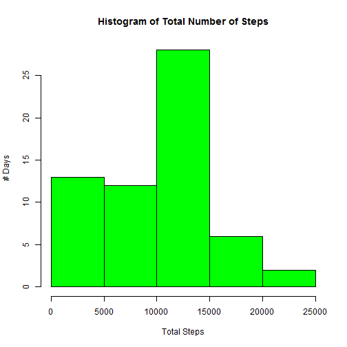
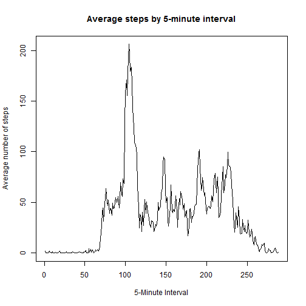
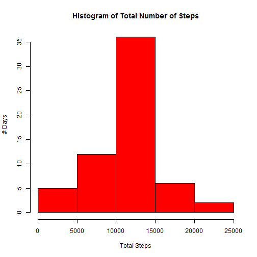
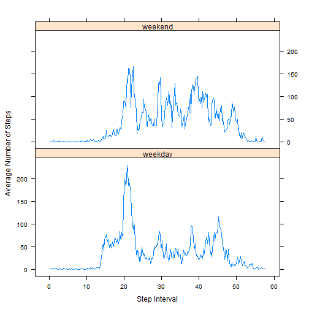

This is the documentation for Peer Assessment 1 as part of Reproducible Results. The data can be downloaded from 
https://d396qusza40orc.cloudfront.net/repdata%2Fdata%2Factivity.zip.
This code assumes the data has been downloaded and unzipped in your working directory. The data file is activity.csv.

#Loading and Preprocessing the data

```r
data <- read.csv("activity.csv",header=TRUE)
```

# What is mean total number of steps taken per day?
Calculate the total number of steps. Remove the NAs, so some days will have 0 steps. Print the head and tail of the result.


```r
library(dplyr)
```

```
## 
## Attaching package: 'dplyr'
## 
## The following objects are masked from 'package:stats':
## 
##     filter, lag
## 
## The following objects are masked from 'package:base':
## 
##     intersect, setdiff, setequal, union
```

```r
dates <- group_by(data,date)
dates_total <- summarize(dates, total = sum(steps,na.rm=TRUE))
head(dates_total)
```

```
## Source: local data frame [6 x 2]
## 
##         date total
## 1 2012-10-01     0
## 2 2012-10-02   126
## 3 2012-10-03 11352
## 4 2012-10-04 12116
## 5 2012-10-05 13294
## 6 2012-10-06 15420
```

```r
tail(dates_total)
```

```
## Source: local data frame [6 x 2]
## 
##         date total
## 1 2012-11-25 11834
## 2 2012-11-26 11162
## 3 2012-11-27 13646
## 4 2012-11-28 10183
## 5 2012-11-29  7047
## 6 2012-11-30     0
```

Histogram of the total number of steps taken each day

 

Calculate the mean and median of the total number of steps taken per day

```r
dates <- group_by(data, date)
mean_median <- summarize(dates, mean = mean (steps, na.rm=TRUE), median = median (steps, na.rm=TRUE))
print(tbl_df(mean_median),n=nrow(mean_median))
```

```
## Source: local data frame [61 x 3]
## 
##          date       mean median
## 1  2012-10-01        NaN     NA
## 2  2012-10-02  0.4375000      0
## 3  2012-10-03 39.4166667      0
## 4  2012-10-04 42.0694444      0
## 5  2012-10-05 46.1597222      0
## 6  2012-10-06 53.5416667      0
## 7  2012-10-07 38.2465278      0
## 8  2012-10-08        NaN     NA
## 9  2012-10-09 44.4826389      0
## 10 2012-10-10 34.3750000      0
## 11 2012-10-11 35.7777778      0
## 12 2012-10-12 60.3541667      0
## 13 2012-10-13 43.1458333      0
## 14 2012-10-14 52.4236111      0
## 15 2012-10-15 35.2048611      0
## 16 2012-10-16 52.3750000      0
## 17 2012-10-17 46.7083333      0
## 18 2012-10-18 34.9166667      0
## 19 2012-10-19 41.0729167      0
## 20 2012-10-20 36.0937500      0
## 21 2012-10-21 30.6284722      0
## 22 2012-10-22 46.7361111      0
## 23 2012-10-23 30.9652778      0
## 24 2012-10-24 29.0104167      0
## 25 2012-10-25  8.6527778      0
## 26 2012-10-26 23.5347222      0
## 27 2012-10-27 35.1354167      0
## 28 2012-10-28 39.7847222      0
## 29 2012-10-29 17.4236111      0
## 30 2012-10-30 34.0937500      0
## 31 2012-10-31 53.5208333      0
## 32 2012-11-01        NaN     NA
## 33 2012-11-02 36.8055556      0
## 34 2012-11-03 36.7048611      0
## 35 2012-11-04        NaN     NA
## 36 2012-11-05 36.2465278      0
## 37 2012-11-06 28.9375000      0
## 38 2012-11-07 44.7326389      0
## 39 2012-11-08 11.1770833      0
## 40 2012-11-09        NaN     NA
## 41 2012-11-10        NaN     NA
## 42 2012-11-11 43.7777778      0
## 43 2012-11-12 37.3784722      0
## 44 2012-11-13 25.4722222      0
## 45 2012-11-14        NaN     NA
## 46 2012-11-15  0.1423611      0
## 47 2012-11-16 18.8923611      0
## 48 2012-11-17 49.7881944      0
## 49 2012-11-18 52.4652778      0
## 50 2012-11-19 30.6979167      0
## 51 2012-11-20 15.5277778      0
## 52 2012-11-21 44.3993056      0
## 53 2012-11-22 70.9270833      0
## 54 2012-11-23 73.5902778      0
## 55 2012-11-24 50.2708333      0
## 56 2012-11-25 41.0902778      0
## 57 2012-11-26 38.7569444      0
## 58 2012-11-27 47.3819444      0
## 59 2012-11-28 35.3576389      0
## 60 2012-11-29 24.4687500      0
## 61 2012-11-30        NaN     NA
```

#What is the average daily activity pattern?
Calculate average number of steps taken across all days


```r
data$interval <- as.factor(data$interval)
int <- group_by(data,interval)
interval_avg <- summarize(int, mean = mean(steps,na.rm=TRUE))
```

Time series plot of the 5-minute interval and the average number of steps taken, averaged across all days.

 

Calculate interval with the maximum average number of steps


```r
interval_avg[which.max(interval_avg$mean),]
```

```
## Source: local data frame [1 x 2]
## 
##   interval     mean
## 1      835 206.1698
```

#Imputing missing values
Calculate and report the total number of day/interval combinations that are missing values


```r
sum(is.na(data$steps))
```

```
## [1] 2304
```

Use the mean for the interval to fill in the missing NAs
Calculate the total number of steps each day using the new data set


```r
new_data <- data %>% group_by(interval) %>% mutate(steps=replace(steps,is.na(steps),mean(steps,na.rm=TRUE)))
dates <- group_by(new_data,date)
dates_total <- summarize(dates,total = sum(steps,na.rm=TRUE))
head(dates_total)
```

```
## Source: local data frame [6 x 2]
## 
##         date    total
## 1 2012-10-01 10766.19
## 2 2012-10-02   126.00
## 3 2012-10-03 11352.00
## 4 2012-10-04 12116.00
## 5 2012-10-05 13294.00
## 6 2012-10-06 15420.00
```

```r
tail(dates_total)
```

```
## Source: local data frame [6 x 2]
## 
##         date    total
## 1 2012-11-25 11834.00
## 2 2012-11-26 11162.00
## 3 2012-11-27 13646.00
## 4 2012-11-28 10183.00
## 5 2012-11-29  7047.00
## 6 2012-11-30 10766.19
```

Histogram of the total number of steps taken each day using the new data set

 

Calculate the mean and median of the total number of steps taken per day using the new data set. Show that the mean and median increase when the averages are used in place of the NA.


```r
dates <- group_by(new_data, date)
mean_median2 <- summarize(dates, mean2 = mean (steps, na.rm=TRUE), median2 = median (steps, na.rm=TRUE))
print(tbl_df(mean_median2),n=nrow(mean_median2))
```

```
## Source: local data frame [61 x 3]
## 
##          date      mean2  median2
## 1  2012-10-01 37.3825996 34.11321
## 2  2012-10-02  0.4375000  0.00000
## 3  2012-10-03 39.4166667  0.00000
## 4  2012-10-04 42.0694444  0.00000
## 5  2012-10-05 46.1597222  0.00000
## 6  2012-10-06 53.5416667  0.00000
## 7  2012-10-07 38.2465278  0.00000
## 8  2012-10-08 37.3825996 34.11321
## 9  2012-10-09 44.4826389  0.00000
## 10 2012-10-10 34.3750000  0.00000
## 11 2012-10-11 35.7777778  0.00000
## 12 2012-10-12 60.3541667  0.00000
## 13 2012-10-13 43.1458333  0.00000
## 14 2012-10-14 52.4236111  0.00000
## 15 2012-10-15 35.2048611  0.00000
## 16 2012-10-16 52.3750000  0.00000
## 17 2012-10-17 46.7083333  0.00000
## 18 2012-10-18 34.9166667  0.00000
## 19 2012-10-19 41.0729167  0.00000
## 20 2012-10-20 36.0937500  0.00000
## 21 2012-10-21 30.6284722  0.00000
## 22 2012-10-22 46.7361111  0.00000
## 23 2012-10-23 30.9652778  0.00000
## 24 2012-10-24 29.0104167  0.00000
## 25 2012-10-25  8.6527778  0.00000
## 26 2012-10-26 23.5347222  0.00000
## 27 2012-10-27 35.1354167  0.00000
## 28 2012-10-28 39.7847222  0.00000
## 29 2012-10-29 17.4236111  0.00000
## 30 2012-10-30 34.0937500  0.00000
## 31 2012-10-31 53.5208333  0.00000
## 32 2012-11-01 37.3825996 34.11321
## 33 2012-11-02 36.8055556  0.00000
## 34 2012-11-03 36.7048611  0.00000
## 35 2012-11-04 37.3825996 34.11321
## 36 2012-11-05 36.2465278  0.00000
## 37 2012-11-06 28.9375000  0.00000
## 38 2012-11-07 44.7326389  0.00000
## 39 2012-11-08 11.1770833  0.00000
## 40 2012-11-09 37.3825996 34.11321
## 41 2012-11-10 37.3825996 34.11321
## 42 2012-11-11 43.7777778  0.00000
## 43 2012-11-12 37.3784722  0.00000
## 44 2012-11-13 25.4722222  0.00000
## 45 2012-11-14 37.3825996 34.11321
## 46 2012-11-15  0.1423611  0.00000
## 47 2012-11-16 18.8923611  0.00000
## 48 2012-11-17 49.7881944  0.00000
## 49 2012-11-18 52.4652778  0.00000
## 50 2012-11-19 30.6979167  0.00000
## 51 2012-11-20 15.5277778  0.00000
## 52 2012-11-21 44.3993056  0.00000
## 53 2012-11-22 70.9270833  0.00000
## 54 2012-11-23 73.5902778  0.00000
## 55 2012-11-24 50.2708333  0.00000
## 56 2012-11-25 41.0902778  0.00000
## 57 2012-11-26 38.7569444  0.00000
## 58 2012-11-27 47.3819444  0.00000
## 59 2012-11-28 35.3576389  0.00000
## 60 2012-11-29 24.4687500  0.00000
## 61 2012-11-30 37.3825996 34.11321
```

The system now computes a median since the NAs are replaced by numbers. The means are greater also, since the NAs are replaced with numbers.

#Are there differences in activity patterns between weekdays and weekends?
Compare activity patterns between weekdays and weekend. Create a new variable in the dataset with two levels - "weekday" and "weekend".


```r
new_data <- mutate(new_data, date = as.Date(date, format = "%Y-%m-%d"))
new_data <- mutate(new_data, weekday = weekdays(date))
new_data$weekday[new_data$weekday == "Saturday" | new_data$weekday == "Sunday"] <- "weekend"
new_data$weekday[new_data$weekday != "weekend"] <- "weekday"
new_data$weekday <- as.factor(new_data$weekday)
#Create new column for timeseries ticks
new_data <- mutate (new_data, ticks = as.integer(interval)/5)
```

Panel plot containing a time series plot of the 5-minute interval (x-axis) and the average number of steps taken, averaged across all weekday days or weekend days (y-axis). 


```
## Warning: package 'lattice' was built under R version 3.2.2
```

 
